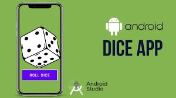

# RollaDice 🎲

RollaDice is a fun and interactive React Native app that simulates rolling a dice. It includes animations, sound effects, haptic feedback, and fun facts to make the experience engaging and enjoyable. Perfect for learning React Native basics or just having fun!

 <!-- Replace with your screenshot -->

---

## Features ✨

- **Realistic Dice Roll**: Roll a 6-sided dice with smooth animations.
- **Sound Effects**: Hear the dice roll sound for an immersive experience.
- **Haptic Feedback**: Feel the roll with subtle vibrations.
- **Fun Facts**: Get a random fun fact after every roll.
- **Score Tracking**: Keep track of your total score and roll history.
- **Reset Option**: Clear your score and roll history with a single tap.
- **Modern UI**: Beautiful gradient backgrounds and clean card designs.

---

## Technologies Used 🛠️

- **React Native**: For building the cross-platform mobile app.
- **Expo**: For easy development and testing.
- **Expo Linear Gradient**: For gradient backgrounds.
- **Expo Audio**: For playing dice roll sound effects.
- **Expo Haptics**: For haptic feedback on dice roll.
- **TypeScript**: For type-safe JavaScript development.

---

## Installation and Setup 🚀

### Prerequisites
- Node.js (v16 or higher)
- Expo CLI (install globally using `npm install -g expo-cli`)
- A mobile device or emulator to test the app.

### Steps to Run the Project
1. **Clone the Repository**:
   ```bash
   git clone https://github.com/your-username/RollaDice.git
   cd RollaDice
